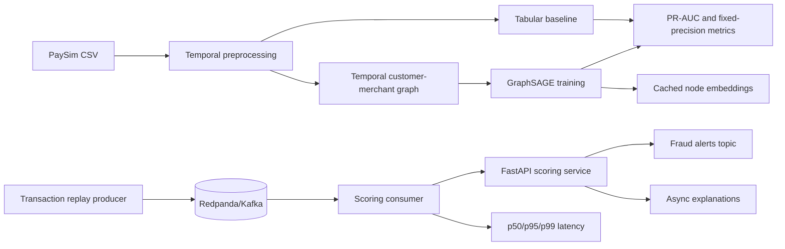

# Real-Time Fraud Detection with Graph Neural Networks

A portfolio project that compares a strong tabular fraud baseline with temporal graph models and serves transaction scores through a local streaming pipeline.

## Phase 0 Decision

**Primary dataset: PaySim.** It has transaction timestamps, customer and merchant identifiers, transaction amounts, transaction types, and fraud labels. That makes it practical for both a temporal graph experiment and a replayable Kafka demo.

| Dataset | Strength | Limitation | Decision |
| --- | --- | --- | --- |
| PaySim | Easy to replay; clear transaction fields; manageable on a laptop | Synthetic; graph structure must be designed from IDs | Primary demo dataset |
| Elliptic Bitcoin | Real graph benchmark with timestamps and labels; available through PyG tooling | It is not a normal payment transaction stream and has limited business semantics | Optional graph benchmark |
| IEEE-CIS Fraud Detection | Richer tabular and identity signals | Larger cleaning effort; Kaggle access; graph joins are more involved | Not in the four-week core scope |

The project will not claim that PaySim results generalize directly to real banking data. Dataset limitations will be reported with the metrics.

## Architecture



### Leakage policy

The split is based on transaction time, never a random row split:

- Train: earliest 70% of timestamps
- Validation: next 15%
- Test: latest 15%

Features for a transaction may only use events earlier than that transaction's timestamp. Rolling customer and merchant statistics are computed with a time-aware `shift`, and graph neighborhoods are restricted to edges observed before the scoring timestamp. Labels from validation and test periods never influence training features, node embeddings, thresholds, or anomaly-model fitting.

## Scope gates

### Core four-week deliverable

1. PaySim schema validation, EDA, and temporal split
2. XGBoost tabular baseline
3. Temporal customer-merchant graph
4. GraphSAGE with capped neighborhood sampling
5. Honest baseline versus GNN ablation
6. Metrics: PR-AUC, fraud-class F1, and recall at fixed precision
7. Redpanda replay producer and scoring consumer
8. FastAPI health and scoring endpoints
9. Docker, MLflow tracking, pytest, and CI
10. Latency and throughput benchmarks with p50/p95/p99

### Conditional extensions

These cannot block the core deliverable:

- Graph autoencoder anomaly score
- GNNExplainer on sampled alerts, preferably asynchronously
- FAISS embedding search if nearest known-fraud accounts improves investigation workflow
- ONNX/TorchScript export if the exact model path supports it; otherwise native PyTorch inference is the documented fallback
- Quantization and deeper caching experiments
- Elliptic benchmark comparison

## Repository layout

```text
.
├── configs/base.yaml
├── data/                  # raw and processed data are not committed
├── docker-compose.yml     # local Redpanda broker
├── src/fraud_detection/
│   ├── cli.py
│   ├── config.py
│   └── __init__.py
├── tests/
├── pyproject.toml
└── README.md
```

## Local setup

Requires Python 3.11+ and Docker Desktop for the streaming phase.

```powershell
python -m venv .venv
.\.venv\Scripts\Activate.ps1
python -m pip install -e ".[test]"
$env:PYTHONPATH = "src"
python -m pytest
python -m fraud_detection.cli
```

Start the local broker when Phase 4 begins:

```powershell
docker compose up -d
```

## Milestones

| Phase | Exit criterion |
| --- | --- |
| 0. Plan | Scaffold, architecture, dataset decision, and tests pass |
| 1. Data and baseline | Reproducible temporal split and baseline metrics saved |
| 2. GNN | GraphSAGE trains without temporal leakage; ablation is complete |
| 3. Anomaly and explanations | Anomaly score and sampled explanations are measured |
| 4. Streaming and serving | A replayed transaction receives a score and alert |
| 5. Optimization | Before/after latency and throughput table is reproducible |
| 6. Portfolio polish | README, demo, limitations, resume bullets, and interview answers |

## Current status

Phase 1 implementation is complete pending the real PaySim file: schema validation, temporal splitting, leakage-safe historical features, and the XGBoost baseline are runnable. The next step is to record the downloaded file's source, checksum, row count, and real baseline metrics in the data card and artifacts.
# finance_fraud_detection
